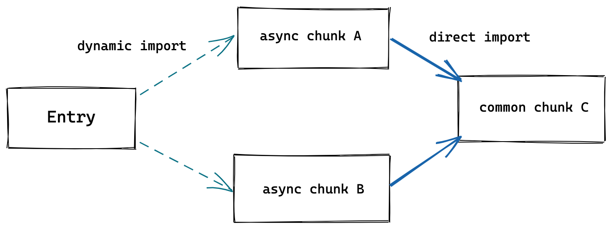

[link](https://cn.vitejs.dev/)

# 1. 什么选 Vite

当前使用 webpack, Rollup, Parcel 等打包器对 JavaScript 项目进行打包.

当构建越来越大型的应用时, 需要处理的 JavaScript 代码量也呈指数级增长, 此时就会碰到两大问题:

## 1.1 缓慢的服务器启动

当冷启动开发服务器时, 基于打包器的方式启动必须优先抓取并构建整个应用, 然后才能提供服务.


Vite 通过在一开始将应用中的模块区分为 **依赖** 和 **源码** 两类, 改进了开发服务器的启动时间.

- **依赖**: 大多为在开发阶段不会变动的纯 JavaScript. 一些较大的依赖 (例如有上百个模块的组件库) 处理的代价很高. 依赖通常会存在多种模块化格式 (如 ESM 或 CommonJS).

  Vite 将会使用 [esbuild](https://esbuild.github.io/) 预构建依赖. Esbuild 使用 Go 编写, 并且比以 JavaScript 编写的打包器预构建依赖快 10-100 倍.

- **源码**: 通常包含一些并非直接是 JavaScript 的文件, 需要转换 (例如: JSX, CSS 或者 Vue/Svelte 组件), 时常会被编辑. 同时, 并不是所有的源代都需要同时被加载 (例如基于路由拆分的代码模块).

  Vite 以 [原生 ESM](https://developer.mozilla.org/en-US/docs/Web/JavaScript/Guide/Modules) 方式提供源码. 实际上是让浏览器接管了打包程序的部分工作. Vite 只需要在浏览器请求源码时进行转换并按需提供源码. 根据场景动态导入代码, 即只在当前屏幕上实际使用时才会被处理.


## 1.2 缓慢的更新

基于打包器启动时, 重建整个包的效率很低. 主要原因还是因为更新速度会随着应用体积增长而直线下降.

一些打包器的开发服务器将构建内容存入内存, 这样在文件更改时使模块图的一部分失活即可, 但这仍需要整个重新构建并重载页面. 这样代价很高, 并且重新加载页面会消除应用的当前状态, 所以打包器支持了动态模块热重载 (HMR): 允许一个模块 "热替换" 它自己, 而不影响页面其余部分, 这大大改进了开发体验, 但速度仍然会随着应用规模的增长而显著下降.

在 Vite 中, HMR 是在原生 ESM 上执行的. 当编辑一个文件时, Vite 只需要精确地使已编辑的模块与其最近的 HMR 边界之间的链失活 (大多数时候只是模块本身), 使得无论应用大小如何, HMR 始终能保持快速更新.

Vite 同时利用 HTTP 头来加整整个页面的重新加载 (再次让浏览器为我们做更多事情): 源码模块的请求会根据 `304 Not Modified`进行协商缓存, 而依赖模块请求则会通过 `Cache-Control: max-age=31536000,immutable`进行强缓存, 因此一旦被缓存它们将不需要再次请求.

## 1.3 为什么生产环境仍需打包

尽管原生 ESM 现在得到了广泛支持, 但嵌套导入会导致额外的网络往返, 在生产环境中发布未打包的 ESM 仍然效率低下 (即使使用 HTTP/2). 为了生产环境中获得最佳的加载性能, 最好还是将代码进行 tree-shaking, 懒加载和 chunk 分割(以获得更好的缓存).

### a. 为何不用 ESBuild 打包?

虽然 `esbuild`快得惊人, 并且已经是一个在构建库方面比较出色的工具, 但一些针对构建应用的重要功能仍然还在持续开发中 - 特别是代码分割和 CSS 处理方面. 目前来说 Rollup 在应用打包方面更加成熟和灵活. 未来在这些功能稳定后, 不排除使用 `esbuild`作为生产构建器的可能.

# 2. 开始

## 2.1 总览

Vite (法语意为 "快速的", 发音 `/vit/`) 是一种新型前端构建工具, 能够显著提升前端开发体验. 它主要由两部分组成:

- 一个开发服务器, 它基于 **原生 ES 模块** 提供了丰富的内建功能, 如速度快到惊人的 **模块热更新 (HMR)**.
- 一套构建指令, 它使用 Rollup 打包你的代码, 并且它是预配置的, 可输出用于生产环境的高度优化过的静态资源.

Vite 意在提供开箱即用的配置, 同时它的 **插件 API** 和 **JavaScript API** 带来了高度的可扩展性, 并有完整的类型支持.

## 2.2 浏览器支持

默认的构建目标浏览器是能 [在 script 标签上支持原生 ESM](https://caniuse.com/es6-module) 和 [原生 ESM 动态导入](https://caniuse.com/es6-module-dynamic-import). 传统浏览器可以通过官方插件 [@vitejs/plugin-legacy](https://github.com/vitejs/vite/tree/main/packages/plugin-legacy) 支持.

## 2.3 搭建第一个 Vite 项目

> **兼容性注意**
>
> Vite 需要 Node.js 版本 >= 12.0.0.

使用 NPM:

```bash
npm init vite@latest
```

使用 Yarn:

```bash
yarn create vite
```

使用 PNPM:

```bash
pnpx create-vite
```

还可以通过附加的命令行选项直接指定**项目名称**和想要**使用的模板**.

例如, 要构建一个 Vite + Vue 项目:

```bash
# npm 6.x
npm init vite@latest my-vue-app --template vue

# npm 7+, 需要额外的双横线
npm init vite@latest my-vue-app -- --template vue

# yarn
yarn create vite my-vue-app --template vue
```

支持的模板预设包括:

- vanilla
- vanilla-ts
- vue
- vue-ts
- react
- react-ts
- preact
- preact-ts
- lit-element
- lit-element-ts
- svelte
- svelte-ts

## 2.4 社区模板

`create-vite`是一个快速生成主流框架基础模板的工具. 查看 Awesome Vite 仓库的 [社区维护模板](https://github.com/vitejs/awesome-vite#templates), 里面包含各种工具和不同框架的模板. 你可以用如 [degit](https://github.com/Rich-Harris/degit) 之类的工具, 使用社区模板来搭建项目.

```sh
npx degit user/project my-project
cd my-project

npm install
npm run dev
```

如果该项目使用 `main`作为默认分支, 需要在项目名后添加 `#main`.

```sh
npx degit user/project#main my-project
```

## 2.5 `index.html`与项目根目录

在一个 Vite 项目中, `index.html`在项目最外层而不是在 `public`文件夹内. 这是有意而为之的: 在开发期间 Vite 是一个服务器, 而 `index.html`是该 Vite 项目的入口文件.

Vite 将 `index.html`视为源码和模块图的一部分. Vite 解析 `<script type="module" src="...">`, 这个标签指向 JavaScript 源码. 甚至内联引入 JavaScript 的 `<script type="module">` 和引用 CSS 的 `<link href>` 也能利用 Vite 特有的功能被解析. 另外, `index.html`中的 URL 将被自动转换, 因此不再需要 `%PUBLIC_URL%`占位符了.

与静态 HTTP 服务器类似, Vite 也有 "根目录" 的概念, 即服务文件的位置. 在接下来的文档中将看到它会以 `<root>`代称. 源码中的绝对 URL 路径将以项目的 "根" 作为基础来解析, 因此你可以像在普通的静态文件服务器上一样编写代码 (并且功能更强大!). Vite 还能够处理依赖关系, 解析处于根目录外的文件位置, 这使得它即使在基于 monorepo 的方案中也十分有用.

Vite 也支持多个 `.html`作入口点的多页面应用模式.

### a. 指定替代根目录

`vite` 以当前工作目录作为根目录启动开发服务器. 也可以通过 `vite serve some/sub/dir`来指定一个替代的根目录.

## 2.6 命令行界面

在安装了 Vite 的项目中, 可以在 npm scripts 中使用 `vite`可执行文件, 或者直接使用 `npx vite`运行. 下面是通过脚手架创建的 Vite 项目中默认的 npm scripts:

```json
{
    "scripts": {
        "dev": "vite", // 启动开发服务器
        "build": "vite build", // 为生产环境构建
        "serve": "vite preview" // 本地预览生产构建
    }
}
```

可以指定额外的命令行选项, 如 `--port`或 `--https`. 运行 `npx vite --help`获得完整的命令行选项列表.

## 2.7 使用未发布的功能

想要体验最新的功能, 可以自行克隆 [vite 仓库](https://github.com/vitejs/vite)到本地机器上然后自行将其链接 (需要 Yarn 1.x):

```sh
git clone https://github.com/vitejs/vite.git
cd vite
yarn
cd packages/vite
yarn build
yarn link
```

然后, 回到你的 vite 项目并运行 `yarn link vite`. 重新启动开发服务器 (`yarn dev`)来体验新功能.

# 3. 功能

对基础的使用来说, 使用 Vite 开发和使用一个静态文件服务器并没有太大功能. 然而, Vite 还通过原生 ESM 导入提供了许多主要用于打包场景的增强功能.

## 3.1 NPM 依赖解析和预构建

原生 ES 导入不支持下面这样的裸模块导入:

```js
import { someMethod } from 'my-dep';
```

上面的代码会在浏览器中抛出一个错误. Vite 将会检测到所有被加载的源文件中的此类裸模块导入, 并执行以下操作:

1. 预构建它们可以提高页面加载速度, 并将 CommonJS / UMD 转换为 ESM 格式. 预构建这一步由 esbuild 执行, 这使得 Vite 的冷启动时间比任何基于 JavaScript 的打包器都要快得多.
2. 重写导入合法的 URL, 例如 `/node_modules/.vite/my-dep.js?v=f3sf2ebd`以便浏览器能够正确导入它们.

## 3.2 模块热重载

Vite 提供了一套原生 ESM 的 HMR API. 具有 HMR 功能的框架可以利用该 API 提供即时, 准确的更新, 而无需重新加载页面或清除应用程序状态. Vite 内置了 HMR 到 [Vue 单文件组件 (SFC)](https://github.com/vitejs/vite/tree/main/packages/plugin-vue) 和 [React Fast Refresh](https://github.com/vitejs/vite/tree/main/packages/plugin-react-refresh) 中. 也通过 [@prefresh/vite](https://github.com/preactjs/prefresh/tree/main/packages/vite) 对 Preact 实现了官方集成.

## 3.3 TypeScript

Vite 天然支持引入 `.ts`文件.

Vite 仅执行 `.ts`文件的转译工作, 并**不执行**任何类型检查. 并假设类型检查已经被你的 IDE 或构建过程接管了 (你可以在构建脚本中运行 `tsc --noEmit`或者安装 `vue-tsc`然后运行 `vue-tsc --noEmit`来对你的 `*.vue`文件做类型检查).

Vite 使用 esbuild 将 TypeScript 转译到 JavaScript, 约是 `tsc`速度的20-30倍, 同时 HMR 更新反应到浏览器的时间小于 50ms.

### a. TypeScript 编译器选项

`tsconfig.json`中 `compilerOptions`下的一些配置项需要特别注意.

#### `isolatedModules`

应该设置为 `true`.

这是因为 `esbuild`只执行没有类型信息的转译, 它并不支持某些特性, 如 `const enum`和隐式类型导入.

你必须在 `tsconfig.json`中的 `compilerOptions`下设置 `"isolatedModules": true`. 如此做, TS 会警告你不要使用隔离 (isolated) 转译的功能.

#### `useDefineForClassFields`

从 Vite v2.5.0 开始, 如果 TypeScript 的 target 是 `ESNext`, 此选项默认值则为 `true`. 这与 `tsc`v4.3.2 及以后版本的行为一致. 这也是标准的 ECMAScript 的运行时行为.

但对于那些习惯其他编程语言或旧版本 TypeScript 的开发者来说, 这可能是违反直觉的.

如果你正在使用一个严重依赖 class fields 的库, 请注意该库对此选项的预期设置.

大多数库都希望该值为 `true`, 如 MobX, Vue Class Components 8.x 等.

但是有几个库还没有兼容这个新的默认值, 其中包括 `lit-element`.

#### `影响构建结果的其他编译器选项`

- `extends`
- `importsNotUsedAsValues`
- `jsxFactory`
- `jsxFragmentFactory`

### b. 客户端类型

Vite 默认的类型定义是写给它的 Node.js API 的. 要将其补充到一个 Vite 应用的客户端代码环境中, 请添加一个 `d.ts`声明文件.

```ts
/// <reference types="vite/clinet" />
```

同时, 你也可以将 `vite/client`添加到 `tsconfig`中的 `compilerOptions.types`下.

```json
{
    "compilerOptions": {
        "types": ["vite/client"]
    }
}
```

这将会提供以下类型定义补充:

- 资源导入 (例如: 导入一个 `.svg`文件)
- `import.meta.env`上 Vite 注入的环境变量的类型定义
- `import.meta.hot`上的 HMR API 类型定义

## 3.4 Vue

Vite 为 Vue 提供第一优先级支持:

- Vue3 单文件组件支持: [@vitejs/plugin-vue](https://github.com/vitejs/vite/tree/main/packages/plugin-vue)
- Vue3 JSX 支持: [@vitejs/plugin-vue-jsx](https://github.com/vitejs/vite/tree/main/packages/plugin-vue-jsx)
- Vue2 支持: [underfin/vite-plugin-vue2](https://github.com/underfin/vite-plugin-vue2)

## 3.5 JSX

`.jsx`和 `.tsx`文件同样开箱即用. JSX 的转译同样是通过 esbuild, 默认为 React 16 风格. 期望 esbuild 中支持 React 17 风格的 JSX 请看[这里](https://github.com/evanw/esbuild/issues/334).

Vue 用户应使用官方提供的 @vitejs/plugin-vue-jsx 插件, 它提供了 Vue3 特性的支持, 包括 HMR, 全局组件解析, 指令和插槽.

如果不是在 React 或 Vue 中使用 JSX, 自定义的 `jsxFactory`和 `jsxFragment`可以使用 esbuild 选项进行配置. 例如对 Preact:

```js
// vite.config.js
export default defineConfig({
    esbuild: {
        jsxFactory: 'h',
        jsxFragment: 'Fragment'
    }
});
```

可以使用 `jsxInject` (这是一个仅在 Vite 中使用的选项) 为 JSX 注入 helper, 避免手动导入:

```js
// vite.config.js
export default defineConfig({
    esbuild: {
        jsxInject: `import React from 'react'`
    }
})
```

## 3.6 CSS

导入 `.css`文件将会把内容插入到 `<style>`标签中, 同时也带有 HMR 支持. 也能够以字符串的形式检索处理后的, 作为其模块默认导出的 CSS.

### a. `@import`内联和变基

Vite 通过 `postcss-import`预配置支持了 CSS `@import`内联, Vite 的路径别名也遵从 CSS `@import`. 换句话说, 所有 CSS `url()`引用, 即使导入的文件在不同的目录中, 也总是自动变基, 以确保正确性.

Sass 和 Less 文件也支持 `@import`别名和 URL 变基.

### b. PostCSS

如果项目包含有效的 PostCSS 配置 (任何受 [postcss-load-config](https://github.com/postcss/postcss-load-config)支持的格式, 例如 `postcss.config.js`), 它将会自动应用于所有已导入的 CSS.

### c. CSS Modules

任何以 `.module.css`为后缀名的 CSS 文件都被认为是一个 [CSS modules 文件](https://github.com/css-modules/css-modules). 导入这样的文件会返回一个相应的模块对象.

```css
/* example.module.css */
.red {
    color: red;
}
```

```js
import classes from './example.module.css';
document.getElementById('foo').className = classes.red;
```

CSS modules 行为可以通过 `css.modules`选项进行配置.

如果 `css.modules.localsConvention`设置开启了 camelCase 格式变量名转换 (例如 `localsConvention: 'camelCaseOnly'`), 你还可以使用按名导入.

```js
// .apply-color => applyColor
import { applyColor } from './example.module.css';
document.getElementById('foo').className = applyColor;
```

### d. CSS 预处理器

由于 Vite 的目标仅为现代浏览器, 因此建议使用原生 CSS 变量和实现 CSSWG 草案的 PostCSS 插件 (例如 [postcss-nesting](https://github.com/csstools/postcss-nesting))来编写简单的, 符合未来标准的 CSS.

话虽如此, 但 Vite 也同时提供了对 `.scss .sass .less .styl .stylus`文件的内置支持. 没有必要为它们安装特定的 Vite 插件, 但必须安装相应的预处理器依赖:

```sh
# .scss .sass
npm i -D sass

# .less
npm i -D less

# .styl .stylus
npm i -D stylus
```

如果用的是单文件组件, 可以通过 `<style lang="sass">`或其他预处理器自动开启.

Vite 为 Sass 和 Less 改进了 `@import`解析, 以保证 Vite 别名也能被使用. 另外, `url()`中的相对路径引用的, 与根文件不同目录中的 Sass/Less 文件会自动变基以保证正确性.

由于 Stylus API 限制, `@import`别名和 URL 变基不支持 Stylus.

还可以通过在文件扩展名前加上 `.module`来结合使用 CSS modules 和预处理器, 例如 `style.module.scss`.

## 3.7 静态资源处理

导入一个静态资源会返回解析后的 URL:

```js
import imgUrl from './img.png';
document.getElementById('hero-img').src = imgUrl;
```

添加一些特殊的查询参数可以更改资源被引入的方式:

```js
// 显式加载资源为一个 URL
import assetAsURL from './asset.js?url'

// 以字符串形式加载资源
import assetAsString from './shader.glsl?raw'

// 加载为 Web Worker
import Worker from './worker.js?worker'

// 在构建时 Web Worker 内联为 base64 字符串
import InlineWorker from './worker.js?worker&inline'
```

## 3.8 JSON

JSON 可以被直接导入, 同样支持具名导入:

```js
// 导入整个对象
import json from './example.json'

// 对一个根字段使用具名导入, 有效帮助 treeshaking
import { field } from './example.json'
```

## 3.9 Glob 导入

Vite 支持使用特殊的 `import.meta.glob`函数从文件系统导入多个模块

```js
const modules = import.meta.glob('./dir/*.js');
```

以上将会被转译为下面的样子:

```js
// vite 生成的代码
const modules = {
    './dir/foo.js': () => import('./dir/foo.js'),
    './dir/bar.js': () => import('./dir/bar.js')
}
```

你可以遍历 `modules`对象的 key 值来访问相应的模块

```js
for(const path in modules) {
    modules[path]().then(mod => {
        console.log(path, mod);
    });
}
```

匹配到的文件默认是懒加载的, 通过动态导入实现, 并会在构建时分离为独立的 chunk. 如果倾向于直接引入所有的模块 (例如依赖于这些模块中的副作用首先被应用), 你可以使用 `import.meta.globEager`代替:

```js
const modules = import.meta.globEager('./dir/*.js')
```

以上会被转译为下面的样子:

```js
// vite 生成的代码
import * as __glob__0_0 from './dir/foo.js';
import * as __glob__0_1 from './dir/bar.js';
const modules = {
    './dir/foo.js': __glob__0_0,
    './dir/bar.js': __glob__0_1
}
```

请注意:

- 这是一个 Vite 独有的功能而不是一个 Web 或 ES 标准.
- 该 Glob 模式会被当成导入标识符: 必须是相对路径 (以 `./`开头)或绝对路径 (以 `/`开头, 相对于项目根目录解析).
- Glob 匹配是使用 `fast-glob`来实现的, 阅读它的文档来查阅 [支持的 Glob 模式](https://github.com/mrmlnc/fast-glob#pattern-syntax).

## 3.10 WebAssembly

预编译的 `.wasm`文件可以直接被导入 - 默认导出一个函数, 返回值为所导出 wasm 实例对象的 Promise:

```js
import init from './example.wasm'

init().then(exports => {
    exports.test();
})
```

`init`函数还可以将传递给 `WebAssembly.instantiate`的导入对象作为其第二个参数:

```js
init({
    imports: {
        someFunc: () => {

        }
    }
}).then(()=>{

});
```

在生产构建中, 体积小于 `assetInlineLimit`的 `.wasm`文件将会被内联为 base64 字符串. 否则, 它们将作为资源复制到 `dist`目录中, 并按需获取.

## 3.11 Web Worker

一个 web worker 脚本可以直接通过添加一个 `?worker`或 `?sharedworker`查询参数来导入. 默认导出一个自定义的 worker 构造器:

```js
import MyWorker from './worker?worker';

const worker = new MyWorker();
```

Worker 脚本也可以使用 `import`语句来替代 `importScripts()` - 注意, 在开发过程中, 这依赖于浏览器原生支持, 目前只在 Chrome 中适用, 而在生产版本中, 它已经被编译掉了.

默认情况下, worker 脚本将在生产构建中编译成单独的 chunk. 如果你想将 worker 内联为 base64 字符串, 请添加 `inline`查询参数:

```js
import MyWorker from './worker?worker&inline'
```

## 3.12 构建优化

### a. CSS 代码分割

Vite 会自动地将一个异步 chunk 模块中使用到的 CSS 代码抽取出来并为其生成一个单独的文件. 这个 CSS 文件将在该异步 chunk 加载完成时自动通过一个 `<link>`标签载入, 该异步 chunk 会保证只在 CSS 加载完毕后再执行, 避免发生 [FOUC](https://en.wikipedia.org/wiki/Flash_of_unstyled_content#:~:text=A%20flash%20of%20unstyled%20content,before%20all%20information%20is%20retrieved.).

如果你更倾向于将所有的 CSS 抽取到一个文件中, 你可以通过设置 `build.cssCodeSplit`为 `false`来禁用 CSS 代码分割.

### b. 预加载指令生成

Vite 会为入口 chunk 和它们在打包出的 HTML 中的直接引入自动生成 `<link rel="modulepreload">`指令.

### c. 异步 Chunk 加载优化

在实际项目中, Rollup 通常会生成 "共用" chunk - 被两个或以上的其他 chunk 共享的 chunk. 与动态导入相结合, 会很容易出现下面这种场景:



在无优化的情境下, 当异步 chunk `A`被导入时, 浏览器将必须请求和解析 `A`, 然后它才能弄清楚它也需要共用 chunk `C`. 这会导致额外的网络往返:

```
Entry ---> A ---> C
```

Vite 将使用一个预加载步骤自动重写代码, 来分割动态导入调用, 以实现当 `A`被请求时, `C`也将同时被请求:

```
Entry ---> (A + C)
```

`C`也可能有更深的导入, 在未优化的场景中, 这会导致更多的网络往返. Vite 的优化会跟踪所有的直接导入, 无论导入的深度如何, 都能够完全消除不必要的往返.

# 4. 使用插件

Vite 可以使用插件进行扩展, 这得益于 Rollup 优秀的插件接口设计和一部分 Vite 独有的额外选项. 这意味着 Vite 用户可以利用 Rollup 插件的强大生态系统, 同时根据需要也能够扩展开发服务器和 SSR 功能.

## 4.1 添加一个插件

若要使用一个插件, 需要将它添加到项目的 `devDependencies`并在 `vite.config.js`配置文件中的 `plugins`数组中引入它. 例如, 要想为传统浏览器提供支持, 可以按下面这样使用官方插件 @vitejs/plugin-legacy :

```sh
npm i -D @vitejs/plugin-legacy
```

```js
// vite.config.js
import legacy from '@vitejs/plugin-legacy';
import { defineConfig } from 'vite';

export default defineConfig({
    plugins: [
        legacy({
            targets: ['defaults', 'not IE 11']
        })
    ]
});
```

`plugins`也可以接受包含多个插件作为单个元素的预设. 这对于使用多个插件实现的复杂特性 (如框架集成) 很有用. 该数组将在内部被扁平化.

Falsy 虚值的插件将被忽略, 可以用来轻松地启用或停用插件.

## 4.2 查找插件

> **注意**
>
> Vite 旨在为常见的 Web 开发范式提供开箱即用的支持. 在寻找一个 Vite 或兼容的 Rollup 插件之间, 请先查看功能指引. 大量在 Rollup 项目中需要使用插件的用例在 Vite 中已经覆盖到了.

查看 Plugins 章节 获取官方插件信息. 社区插件列表请参见 [awesome-vite](https://github.com/vitejs/awesome-vite#plugins). 而对于兼容的 Rollup 插件, 请查看 [Vite Rollup 插件](https://vite-rollup-plugins.patak.dev/) 获取一个带使用说明的兼容 Rollup 官方插件列表, 若列表中没有找到, 则请参阅 Rollup 插件兼容性章节.

也可以使用此 [npm Vite 插件搜索链接](https://vite-rollup-plugins.patak.dev/) 来找到一些遵循了 推荐约定 的 Vite 插件, 或通过 [npm Rollup 插件搜索链接](https://www.npmjs.com/search?q=rollup-plugin&ranking=popularity) 获取 Rollup 插件.

## 4.3 强制插件排序

为了与某些 Rollup 插件兼容, 可能需要强制执行插件的顺序, 或者只在构建时使用. 这应该是 Vite 插件的实现细节. 可以使用 `enforce`修饰符来强制插件的位置:

- `pre`: 在 Vite 核心插件之前调用该插件
- 默认: 在 Vite 核心插件之后调用该插件
- `post`: 在 Vite 构建插件之后调用该插件

```js
// vite.config.js
import image from '@rollup/plugin-image'
import { defaultConfig } from 'vite'

export default defineConfig({
    plugins: [
        {
            ...image(),
            enforce: 'pre'
        }
    ]
});
```

查看 Plugins API Guide 获取细节信息, 并在 Vite Rollup 插件 兼容性列表中注意 `encorce`标签和流行插件的使用说明.

## 4.4 按需应用

默认情况下插件在开发 (serve) 和生产 (build) 模式中都会调用. 如果插件在服务或构建期间按需使用, 请使用 `apply`属性指明它们仅在 `'build'`或 `'serve'`模式时调用:

```js
// vite.config.js
import typescript2 from 'rollup-plugin-typescript2'
import { defineConfig } from 'vite'

export default defineConfig({
    plugins: [
        {
            ...typescript2(),
            apply: 'build'
        }
    ]
});
```

## 4.5 创建插件

阅读 插件 API 指引 文档了解如何创建插件.

# 5. 依赖预构建

当你首次启动 Vite 时, 你可能会注意到打印出了以下信息:

```
Optimizable dependencies detected: （侦测到可优化的依赖：）
react, react-dom
Pre-bundling them to speed up dev server page load...（将预构建它们以提升开发服务器页面加载速度）
(this will be run only when your dependencies have changed)（这将只会在你的依赖发生变化时执行）
```

## 5.1 原因

这就是 Vite 执行的所谓的 "依赖项构建". 这个过程有两个目的:

1. **CommonJS 和 UMD 兼容性:** 开发阶段中, Vite 的开发服务器将所有代码视为原生 ES 模块. 因此, Vite 必须先将作为 CommonJS 或 UMD 发布的依赖项转换为 ESM.

   当转换 CommonJS 依赖时, Vite 会执行智能导入分析, 这样即使导出是动态分配的 (如 React), 按名导入也会符合预期效果:

   ```js
   import React, { useState } from 'react';
   ```

2. **性能:** Vite 将有许多内部模块的 ESM 依赖关系转换为单个模块, 以提高后续页面加载性能.

   一些包将它们的 ES 模块构建作为许多单独的文件相互导入. 例如, `lodash-es`有超过 600 个内置模块! 当我们执行 `import { debounce } from 'lodash-es'`时, 浏览器同时发出 600 多个 HTTP 请求! 尽管服务器在处理这些请求时没有问题, 但大量的请求会在浏览器端造成网络拥塞, 导致页面的加载速度相当慢.

   通过预构建 `lodash-es`成为一个模块, 我们就只需要一个 HTTP 请求了!

## 5.2 自动依赖搜寻

如果没有找到相应的缓存, Vite 将抓取你的源码, 并自动寻找引入的依赖项 (即 "bare import", 表示期望从 `node_modules`解析), 并将这些依赖项作为预构建包的入口点. 预构建通过 esbuild 执行, 所以它通常非常快.

在服务器已经启动之后, 如果遇到一个新的依赖关系导入, 而这个依赖关系还没有在缓存中, Vite 将重新运行依赖构建进程并重新加载页面.

## 5.3 Monorepo 和链接依赖

在一个 monorepo 启动中, 该仓库中的某个依赖可能会成为另一个包的依赖. Vite 会自动侦测没有从 `node_modules`解析的依赖项, 并将链接的依赖视为源码. 它不会尝试打包被链接的依赖, 而是会分析被链接依赖的依赖列表.

> 注意:
>
> 由于依赖关系的处理方式不同, 链接的依赖关系在最终构建时可能无法正常工作. 使用 `npm package`代替所有本地依赖, 以避免最终的 bundle 问题.

## 5.4 自定义行为

默认的依赖项发现为启发式可能并不总是可取的. 在你想要显式地从列表中包含/排除依赖项的情况下, 请使用 `optimizeDeps`配置项.

当你遇到不能直接在源码中发现的 import 时, `optimizeDeps.include`或 `optimizeDeps.exclude`就是典型的用例. 例如, import 可能是插件转换的结果. 这意味着 Vite 无法在初始扫描时发现 import , 它只能在浏览器请求文件时转换后才能发现. 这将导致服务器在启动后立即重新打包.

`include`和 `exclude`都可以用来处理这个问题. 如果依赖项很大 (包含很多内部模块) 或者是 CommonJS, 那么你应该 `include`它. 如果依赖项很小, 并且已经是有效的 ESM, 则可以 `exclude`它, 让浏览器直接加载它.

## 5.5 缓存

### a. 文件系统缓存

Vite 会将预构建的依赖缓存到 `node_modules/.vite`. 它根据几个源来决定是否需要重新运行预构建步骤:

- `package.json`中的 `dependencies`列表
- 包管理器的 lockfile, 例如 `package-lock.json`, `yarn.lock`, 或者 `pnpm-lock.yaml`
- 可能在 `vite.config.js`相关字段中配置过的

只有在上述其中一项发生更改时, 才需要重新运行预构建.

如果出于某些原因, 想要强制 Vite 重新构建依赖, 可以用 `--force`命令行选项启动开发服务器, 或者手动删除 `node_modules/.vite`目录.

### b. 浏览器缓存

解析后的依赖请求会以 HTTP 头 `max-age=31536000,immutable`强缓存, 以提高在开发时的页面重载性能. 一旦被缓存, 这些请求将永远不会再到达开发服务器. 如果安装了不同的版本 (这反映在包管理器的 lockfile 中), 则附加的版本 query 会自动使它们失效. 如果想通过本地编辑来调试依赖项, 你可以:

1. 通过浏览器调试工具的 Network 选项卡暂时禁用缓存.
2. 重启 Vite dev server, 并添加 `--force`命令以重新构建依赖.
3. 重新载入页面

# 6. 静态资源处理

## 6.1 将资源引入为 URL

引入一个静态资源会返回解析后的公共路径:

```js
import imgUrl from './img.png'
document.getElementById('hero-img').src = imgUrl;
```

例如, `imgUrl`在开发时会是 `/img.png`, 在生产构建后可能是 `/assets/img.2d8efhg.png`.

行为类似于 Webpack 的 `file-loader`. 区别在于导入既可以使用绝对公共路径 (基于开发期间的项目根路径), 也可以使用相对路径.

- `url()`在 CSS 中的引用也以同样的方式处理.
- 如果 Vite 使用了 Vue 插件, Vue SFC 模板中的资源引用都将自动转换为导入.
- 常见的图像, 媒体和字体文件类型被自动检测为资源. 你可以使用 `assetsInclude`选项扩展内部列表.
- 引用的资源作为构建资源图的一部分包括在内, 将生成散列文件名, 并可以由插件进行处理以进行优化.
- 较小的资源体积小于 `assetsInlineLimit`选项值则会被内联为 base64 data URL.

### a. 显式 URL 引入

未被包含在内部列表或 `assetsInclude`中的资源, 可以使用 `?url`后缀显式导入为一个 URL. 这十分有用, 例如要导入 [Houdini Paint Worklets](https://houdini.how/usage/) 时:

```js
import workletURL from 'extra-scalloped-border/worklet.js?url';
CSS.paintWorklet.addModule(workletURL);
```

### b. 将资源引入为字符串

资源可以使用 `?raw`后缀声明作为字符串引入.

```js
import shaderString from './shader.glsl?raw';
```

### c. 导入脚本作为 Worker

脚本可以通过 `?worker`或 `?sharedworker`后缀导入为 web worker.

```js
// 在生产构建中将会分离出 chunk
import Worker from './shader.js?worker'
const worker = new Worker()
```

```js
// sharedworker
import SharedWorker from './shader.js?sharedworker'
const sharedWorker = new SharedWorker()
```

```js
// 内联为 base64 字符串
import InlineWorker from './shader.js?worker&inline'
```

查看 Web Worker 小节 获取更多细节.

### d. `public`目录

如果你有下列资源:

- 不会被源码引用 (如 `robots.txt`)
- 必须保持原有文件名 (不需要经过 hash)
- 或者压根不想引入该资源, 只是想得到其 URL

那么你可以将该资源放在指定的 `public`目录中, 它应位于你的项目根目录. 该目录中的资源在开发时能直接通过 `/`根路径访问到, 并且打包时会被完整复制到目标目录的根目录下.

目录默认是 `<root>/public`, 但可以通过 `publicDir`选项来配置.

请注意:

- 引入 `public`中的资源永远应该使用根绝对路径 - 举个例子, `public/icon.png`应该在源码中被引用为 `/icon.png`.
- `public`中的资源不应该被 JavaScript 文件引用.

## 6.2 new URL(url, import.meta.url)

`import.meta.url`是一个 ESM 的原生功能, 会暴露当前模块的 URL. 将它与原生的 URL 构造器 组合使用, 在一个 JavaScript 模块中, 通过相对路径我们就能得到一个被完整解析的静态资源 URL:

```js
const imgUrl = new URL('./img.png', import.meta.url);

document.getElementById('hero-img').src = imgUrl;
```

这在现代浏览器中能够原生使用 - 实际上, Vite 并不需要在开发阶段处理这些代码!

这个模式同样还可以通过字符串模板支持动态 URL:

```js
function getImageUrl(name) {
    return new URL(`./dir/${name}.png`, import.meta.url).href;
}
```

在生产构建时, Vite 才会进行必要的转换保证 URL 在打包和资源哈希后仍指向正确的地址.

> 注意: 无法在 SSR 中使用
>
> 如果你正在以服务端渲染模式使用 Vite 则此模式不支持, 因为 `import.meta.url`在浏览器和 Node.js 中有不同的语义. 服务端的产物也无法预先确定客户端主机 URL.

# 7. 构建生产版本

当需要将应用部署到生产环境时, 只需运行 `vite build`命令. 默认情况下, 它使用 `<root>/index.html`作为其构建入口点, 并生成能够静态部署的应用程序包. 请查阅 部署静态站点 获取常见服务的部署指引.

## 7.1 浏览器兼容性

用于生产的构建包会假设目标浏览器支持现代 JavaScript 语法. 默认情况下, vite 的目标浏览器是指能够 [支持原生 ESM script 标签](https://caniuse.com/es6-module) 和 [支持原生 ESM 动态导入](https://caniuse.com/es6-module-dynamic-import) 的. 作为参考, vite 使用这个 [browserslist](https://github.com/browserslist/browserslist) 作为查询标准:

```
defaults and supports es6-module and supports es6-module-dynamic-import, not opera > 0, not samsung > 0, not and_qq > 0
```

你也可以通过 `build.target`配置项指定构建目标, 最低支持 `es2015`.

请注意, 默认情况下 Vite 只处理语法转译, 且 **默认不包含任何 polyfill**. 你可以前往 [Polyfill.io](https://polyfill.io/v3/)查看, 这是一个基于用户浏览器 User-Agent 字符串自动生成 polyfill 包的服务.

传统浏览器可以通过插件 [@vitejs/plugin-legacy](https://github.com/vitejs/vite/tree/main/packages/plugin-legacy) 来支持, 它将自动生成传统版本的 chunk 及与其相对应 ES 语言特性方面的 polyfill. 兼容版的 chunk 只会在不支持原生 ESM 的浏览器中进行按需加载.

## 7.2 公共基础路径

如果你需要在嵌套的公共路径下部署项目, 只需指定 `base`配置项, 然后所有资源的路径都将据此配置重写. 这个选项也可以通过命令行参数指定, 例如: `vite build --base=/my/public/path/`.

由 JS 引入的资源 URL, CSS 中的 `url()`引用以及 `.html`文件中引用的资源在构建过程中都会自动调整, 以适配此选项.

当然, 情况也有例外, 当访问过程中需要使用动态连接的 url 时, 可以使用全局注入的 `import.meta.env.BASE_URL`变量, 它的值为公共基础路径. 注意, 这个变量在构建时会被静态替换, 因此, 它必须按 `import.meta.env.BASE_URL`的原样出现 (例如 `import.meta.env['BASE_URL']`是无效的)

## 7.3 自定义构建

构建过程可以通过多种 构建配置选项 来自定义构建. 具体来说, 可以通过 `build.rollupOptions`直接调整底层的 Rollup 选项:

```js
// vite.config.js
module.exports = defineConfig({
    build: {
        rollupOptions: {
           // https://rollupjs.org/guide/en/#big-list-of-options 
        }
    }
})
```

例如, 你可以使用仅在构建期间应用的插件来指定多个 Rollup 输出.

## 7.4 文件变化时重新构建

你可以使用 `vite build --watch`来启用 rollup 的监听器. 或者, 你可以直接通过 `build.watch`调整底层的 `WatcherOptions`选项:

```js
// vite.config.js
module.exports = defineConfig({
    build: {
        watch: {
            // https://rollupjs.org/guide/en/#watch-options
        }
    }
})
```

## 7.5 多页面应用模式

假设有下面这样的项目文件结构:

```
├── package.json
├── vite.config.js
├── index.html
├── main.js
└── nested
    ├── index.html
    └── nested.js
```

在开发过程中, 简单地导航或链接到 `/nested/`将会按预期工作, 与正常的静态文件服务器表现一致.

在构建过程中, 你只需指定多个 `.html`文件作为入口点即可.

```js
// vite.config.js
const { resolve } = require('path');
const { defineConfig } = require('vite');

module.exports = defineConfig({
    build: {
        rollupOptions: {
            input: {
                main: resolve(__dirname, 'index.html'),
                nested: resolve(__dirname, 'nested/index.html')
            }
        }
    }
});
```

如果你指定了另一个根目录, 请记住, 在解析输入路径时, `__dirname`的值将仍然是 vite.config.js 文件所在的目录. 因此, 你需要把对应入口文件的 `root`的路径添加到 `resolve`的参数中.

## 7.6 库模式

当你开发面向浏览器的库时, 你可能会将大部分时间花在该库的测试/演示页面上. 在 Vite 中你可以使用 `index.html`获得如丝般中顺滑的开发体验.

当这个库进行发布构建时, 请使用 `build.lib`配置项, 以确保将那些你不想打包进库的依赖进行外部化处理, 例如 `vue`或 `react`:

```js
// vite.config.js
const path = require('path');
const { defineConfig } = require('vite');

module.exports = defineConfig({
    build: {
        lib: {
            entry: path.resolve(__dirname, 'lib/main.js'),
            name: 'MyLib',
            fileName: (format) => `my-lib.${format}.js`
        },
        rollupOptions: {
            // 确保外部化处理那些不想打包进库的依赖
            external: ['vue'],
            output: {
                // 在 UMD 构建模式下为这些外部化的依赖提供一个全局变量
                globals: {
                    vue: 'Vue'
                }
            }
        }
    }
});
```

使用如上配置运行 `vite build`时, 将会使用一套面向库的 Rollup 预设, 并且将为该库提供两种构建格式: `es`和 `umd` (可在 `build.lib`中配置).

推荐在库的 `package.json`中使用如下格式:

```json
{
    "name": "my-lib",
    "files": ["dist"],
    "main": "./dist/my-lib.umd.js",
    "module": "./dist/my-lib.es.js",
    "exports": {
        ".": {
            "import": "./dist/my-lib.es.js",
            "require": "./dist/my-lib.umd.js"
        }
    }
}
```

# 8. 部署静态站点

本指南建立在以下几个假设基础之上:

- 你正在使用的是默认的构建输出路径 (`dist`). 这个路径可以通过 `build.outDir`更改, 在这种情况下, 你可以从这篇指南中找出所需的指引.

- 正在使用 NPM , 或者 Yarn 等其他可以运行下面脚本指令的包管理工具.

- Vite 已作为一个本地开发依赖 (dev dependency) 安装在你的项目中, 并且你已经配置好了如下的 npm scripts:

  ```json
  {
      "scripts": {
          "build": "vite build",
          "serve": "vite preview"
      }
  }
  ```

  值得注意的是 `vite preview`用作预览本地构建, 而不应直接作为生产服务器.

> 注意
>
> 本篇指南提供了部署 Vite 静态站点的说明. Vite 也对服务端渲染 (SSR) 有了实验性的支持. SSR 是指支持在 Node 中运行相应应用的前端框架, 预渲染成 HTML, 最后在客户端激活 (hydrate). 查看 SSR 指南 了解更多细节. 另一方面, 如果你在寻找与传统服务端框架集成的方式, 那么请查看 后端集成 章节.

## 8.1 构建应用

你可以运行 `npm run build`命令来执行应用的构建.

默认情况下, 构建会输出到 `dist`文件夹中. 你可以部署这个 `dist`文件夹到任何你喜欢的平台.

### a. 本地测试应用

当你构建完成应用后, 你可以通过运行 `npm run serve`命令, 在本地测试该应用.

```sh
npm run build
npm run serve
```

`vite preview`命令会在本地启动一个静态 Web 服务器, 将 `dist`文件夹运行在 `http://localhost:5000`. 这样在本地环境下查看该构建产物是否正常可用就方便了.

你可以通过 `--port`参数来配置服务的运行端口.

```json
{
    "scripts": {
        "serve": "vite preview --port 8080"
    }
}
```

## 8.2 GitHub Pages

> 注意
>
> 如果你将 script 的名字 `serve`改为了 `preview`, 你可能会遇到某些包管理工具在处理 [前置 & 后置 scripts](https://docs.npmjs.com/cli/v7/using-npm/scripts#pre--post-scripts) 方面的问题.

1. 在 `vite.config.js`中设置正确的 `base`.

   如果要部署在 `https://<USERNAME>.github.io`上, 你可以省略 `base`使其默认为 `'/'`.

   如果要部署在 `https://<USERNAME>.github.io/<REPO>/`上, 例如你的仓库为 `https://github.com/<USERNAME>/<REPO>`, 那么请设置 `base`为 `/<REPO>/`.

2. 在你的项目中 ,创建一个 `deploy.sh`脚本, 包含以下内容, 运行脚本来部署站点:

   ```sh
   #!/usr/bin/env sh
   
   # 发生错误时终止
   set -e
   
   # 构建
   npm run build
   
   # 进入构建文件夹
   cd dist
   
   # 如果要部署到自定义域名
   # echo 'www.example.com' > CNAME
   
   git init
   git add -A
   git commit -m 'deploy'
   
   # 如果要部署在 https://<USERNAME>.github.io
   # git push -f git@github.com:<USERNAME>/<USERNAME>.github.io.git master
   
   # 如果要部署在 https://<USERNAME>.github.io/<REPO>
   # git push -f git@github.com:<USERNAME>/<REPO>.git master:gh-pages
   
   cd -
   ```

   > TIP
   >
   > 也可以在 CI 中配置该脚本, 使得每次推送代码时自动部署.

### a. GitHub Pages 配合 Travis CI

1. 在 `vite.config.js`中设置正确的 `base`.

   如果要部署在 `https://<USERNAME or GROUP>.github.io/`上, 可以省略 `base`使其默认为 `'/'`.

   如果要部署在 `https://<USERNAME or GROUP>.github.io/<REPO>/`, 例如你的仓库地址为 `https://github.com/<USERNAME>/<REPO>`, 那么请设置 `base`为 `'/<REPO>/'`.

2. 在项目根目录创建一个 `.travis.yml`文件.

3. 在本地运行 `npm install`并且提交 (commit) 生成的 lockfile (`package-lock.json`).

4. 使用 GitHub Pages 部署的配置文件模板, 并按照 [Travis CI 文档](https://docs.travis-ci.com/user/deployment/pages/) 进行配置:

   ```yaml
   language: node_js
   node_js:
   	- lts/*
   install:
   	- npm ci
   script:
   	- npm run build
   deploy:
   	provider: pages
   	skip_cleanup: true
   	local_dir: dist
   	# 在 GitHub 上生成的 token, 允许 Travis 推送代码到你的仓库.
   	# 在仓库的 Travis 设置页面, 设为安全的环境变量
   	github_token: $GITHUB_TOKEN
   	keep_history: true
   	on:
   		branch: master
   ```

## 8.3 GitLab Pages 配合 GitLab CI

1. 在 `vite.config.js`中设置正确的 `base`.

   如果要部署在 `https://<USERNAME or GROUP>.gitlab.io/`上, 可以省略 `base`使其默认为 `'/'`.

   如果要部署在 `https://<USERNAME or GROUP>.gitlab.io/<REPO>/`上, 例如仓库地址为 `https://gitlab.com/<USERNAME>/<REPO>`, 那么请设置 `base`为 `'/<REPO>/'`.

2. 在项目根目录创建一个 `.gitlab-ci.yml`文件, 并包含以下内容. 它将使得每次你更改内容时都重新构建和部署站点:

   ```yaml
   image: node:16.5.0
   pages:
   	stage: deploy
   	cache:
   		key:
   			files:
   				- package-lock.json
   			prefix: npm
   		paths:
   			- node_modules/
   	script:
   		- npm install
   		- npm run build
   		- cp -a dist/. public/
   	artifacts:
   		paths:
   			- public
   	rules:
   		- $CI_COMMIT_BRANCH == $CI_DEFAULT_BRANCH
   ```

## 8.4 Netlify

1. 在 [Netlify](https://www.netlify.com/) 上, 使用以下设置, 配置一个来自 GitHub 的项目:
   - 构建命令: `vite build`或 `npm run build`
   - 发布目录: `dist`
2. 点击部署按钮

## 8.5 Google Firebase

1. 确保已经安装 [firebase-tools](https://www.npmjs.com/package/firebase-tools).

2. 在项目根目录创建 `firebase.json` 和 `.firebaserc`两个文件, 包含以下内容:

   `firebase.json`

   ```json
   {
       "hosting": {
           "public": "dist",
           "ignore": []
       }
   }
   ```

   `.firebaserc`

   ```json
   {
       "projects": {
           "default": "<YOUR_FIREBASE_ID>"
       }
   }
   ```

3. 运行 `npm run build`后, 通过 `firebase deploy`命令部署.

## 8.6 Surge

1. 首先确保已经安装 [surge](https://www.npmjs.com/package/surge).

2. 运行 `npm run build`.

3. 运行 `surge dist` 命令部署到 surge.

你也可以通过添加 `surge dist yourdomain.com` 部署到一个自定义域名.

## 8.7 Heroku

1. 安装 [Heroku CLI](https://devcenter.heroku.com/articles/heroku-cli).

2. 注册一个 Heroku 账号.

3. 运行 `heroku login` 并填入你的 Heroku 凭证.

4. 在项目根目录创建一个 `static.json`, 包含以下内容.

    ```json
    {
        "root": "./dist"
    }
    ```

这是你站点的配置, 阅读 [heroku-buildpack-static](https://github.com/heroku/heroku-buildpack-static) 文档来了解更多.

5. 配置好你的 Heroku git 远程地址

    ```sh
    # 版本变更
    git init
    git add
    git commit -m "My site ready for deployment."

    # 创建一个具有指定名称的新应用
    heroku apps:create example

    # 为静态站点设置 buildpack
    heroku buildpacks:set https://github.com/heroku/heroku-buildpack-static.git
    ```

6. 部署站点

    ```sh
    # 发布站点
    git push heroku master

    # 在浏览器中打开 Heroku 的面板
    heroku open
    ```

## 8.8 Vercel

要通过 [Vercel for Git](https://vercel.com/docs/git) 部署你的 Vite 应用, 请确保它已被推送至一个 Git 仓库.

进入 [https://vercel.com/import/git](https://vercel.com/import/git) 并根据你的 Git 托管服务 (GitHub, GitLab 或 BitBucket) 将项目导入 Vercel. 根据指引, 选择带有 `package.json` 的项目根目录. 并使用 `npm run build` 来覆写构建步骤, 并将输出目录设置为 `./dist`.

在项目被导入之后, 所有后续的推送都将生成预览部署, 但只有对生产分支(通常是 "main")所做的更改才会触发生产部署.

一旦部署, 你会得到一个实时查看应用的 URL.

## 8.9 Azure 的静态网站应用

你可以通过微软 Azure 的 [静态网站应用](https://azure.microsoft.com/zh-cn/services/app-service/static/) 服务来快速部署你的 Vite 应用. 你只需:

- 注册 Azure 账号并获取一个订阅 (subscription) 的 key. 可以在 [此处快速完成注册](https://azure.microsoft.com/zh-cn/free/).

- 将你的应用代码托管到 GitHub.

- 在 VSCode 中安装 [SWA 扩展](https://marketplace.visualstudio.com/items?itemName=ms-azuretools.vscode-azurestaticwebapps).

安装完此扩展后, 进入你应用的根目录. 打开 SWA 的扩展程序, 登录 Azure, 并点击"+", 来创建一个全新的 SWA. 系统会提示你指定所需的订阅 key.

按照扩展程序的启动向导, 给你的应用程序起个名字, 选择框架预设, 并指定应用程序的根目录 (通常为 `/`) 以及构建文件的路径 `/dist`. 此向导完成后, 会在你的 repo 中的 `.github` 文件夹中创建一个 Github Action.

这个 action 致力于部署你的应用程序 (可以在仓库的 Actions 标签中, 查看相关进度), 成功完成后, 你可以点击 Github 中出现的 "浏览站点" 的按钮, 查看你的应用程序.

## 8.10 腾讯云 Webify

[腾讯云 Webify](https://webify.cloudbase.net/) 支持从 Git 仓库直接部署您的 Vite 应用.

进入 [Webify 新建应用页面](https://cloud.tencent.com/login?s_url=https%3A%2F%2Fconsole.cloud.tencent.com%2Fwebify%2Fnew), 根据选择您代码仓库所在的 Git 平台 (GitHub, GitLab 或者 Gitee 码云), 完成授权流程后, 便可导入仓库.

应用配置如下:

- 构建命令填入 `npm run build`

- 输出目录填入 `dist`

- 安装命令填入 `npm install`

应用创建之后, 等待构建, 部署完毕, 便可以通过应用的默认域名 (`.app.tcloudbase.com`) 来访问应用.

# 9. 环境变量和模式

## 9.1 环境变量

Vite 在一个特殊的 `import.meta.env` 对象上暴露环境变量. 这里有一些在所有情况下都可以使用的内建变量:

- `import.meta.env.MODE`: {string} 应用运行的模式.

- `import.meta.env.BASE_URL`: {string} 部署应用时的基本 URL. 它由 `base` 配置项决定.

- `import.meta.env.PROD`: {boolean} 应用是否运行在生产环境.

- `import.meta.env.DEV`: {boolean} 应用是否运行在开发环境 (永远与 `import.meta.env.PROD` 相反).

### 生产环境替换

在生产环境中, 这些环境变量会在构建时被 **表态替换**, 因此, 在引用它们时请使用完全静态的字符串. 动态的 key 将无法生效. 例如, 动态 key 取值 `import.meta.env[key]` 是无效的.

它还将替换出现在 JavaScript 和 Vue 模板中的字符串. 这应该是一种罕见的情况, 但可能是不小心为之的. 有一些方法可以避免这个问题:

- 对于 JavaScript 字符串, 你可以使用 unicode 零宽度空格 `\u200b` (一个看不见的分隔符)来分割这个字符串, 例如: `import.meta\u200b.env.MODE`.

- 对于 Vue 模板或其他编译到 JavaScript 字符串的 HTML, 你可以使用 `<wbr>` 标签, 例如: `import.meta.<wbr>env.MODE`.

## 9.2 `.env` 文件

Vite 使用 [dotenv](https://github.com/motdotla/dotenv) 从你的环境目录中的下列文件加载额外的环境变量:

```
.env                # 所有情况下都会加载
.env.local          # 所有情况下都会加载, 但会被 git 忽略
.env.[mode]         # 只在指定模式下加载
.env.[mode].local   # 只在指定模式下加载, 但会被 git 忽略
```

加载的环境变量也会通过 `import.meta.env` 暴露给客户端源码.

为了防止意外地将一些环境变量泄漏到客户端, 只有以 `VITE_` 为前缀的变量才会暴露给经过 vite 处理的代码。例如下面这个文件中：

```
DB_PASSWORD=foobar
VITE_SOME_KEY=123
```

只有 `VITE_SOME_KEY` 会被暴露为 `import.meta.env.VITE_SOME_KEY` 提供给客户端源码, 而 `DB_PASSWORD` 则不会.

> **安全注意事项**
>
> - `.env.*.local` 文件应是本地的, 可以包含敏感变量. 你应该将 `.local` 添加到你的 `.gitignore` 中, 以避免它们被 git 检入.
>
> - 由于任何暴露给 Vite 源码的变量最终都将出现在客户端包中, `VITE_*` 变量应该不包含任何敏感信息.

### 智能提示

默认情况下, Vite 为 `import.meta.env` 提供了类型定义. 随着在 `.env[mode]` 文件中自定义了越来越多的环境变量, 你可能想要在代码中获取这些以 `VITE_` 为前缀的用户自定义环境变量的 TypeScript 智能提示.

要想做到这一点, 你可以在 `src` 目录下创建一个 `env.d.ts` 文件, 接着按下面这样增加 `ImportMetaEnv` 的定义:

```typescript
interface ImportMetaEnv {
    VITE_APP_TITLE: string
    // 更多环境变量...
}
```

## 9.3 模式

默认情况下, 开发服务器 (`serve` 命令)运行在 `development` (开发)模式, 而 `build` 命令运行在 `production` (生产)模式.

这意味着当执行 `vite build` 时, 它会自动加载 `.env.production` 中可能存在的环境变量:

```
# .env.production
VITE_APP_TITLE=My App
```

在你的应用中, 你可以使用 `import.meta.env.VITE_APP_TITLE` 渲染标题.

然而, 重要的是要理解**模式**是一个更广泛的概念, 而不仅仅是开发和生产. 一个典型的例子是, 你可能希望有一个 "staging" (预发布|预上线)模式, 它应该具有类似于生产的行为, 但环境变量与生产环境略有不同.

你可以通过传递 `--mode` 选项标志来覆盖命令使用的默认模式. 例如, 如果你想为我们假设的 staging 模式构建应用:

```sh
vite build --mode staging
```

为了使应用实现预期行为, 我们还需要一个 `.env.staging` 文件:

```
# .env.staging
NODE_ENV=production
VITE_APP_TITLE=My App (staging)
```

现在, 你的 staging 应用应该具有类似于生产的行为, 但显示的标题与生产环境不同.

# 10. 服务端渲染

> **实验性**
>
> SSR 支持还处于试验阶段, 你可能会遇到 bug 和不受支持的用例. 请考虑你可能承担的风险.

> **注意**
>
> SSR 特别指支持在 Node.js 中运行相同应用程序的前端框架 (例如 React, Preact, Vue 和 Svelte), 将其预渲染成 HTML, 最后在客户端进行注水化处理。 如果你正在寻找与传统服务器端框架的集成, 请查看后端集成指南.
>
> 下面的指南还假定你在选择的框架中有使用 SSR 的经验, 并且只关注特定于 Vite 的集成细节.

> Low-Level API
>
> 这是一个底层的 API, 是为库和框架作者准备的. 如果你的目标是构建一个应用程序, 请确保优先查看 Vite SSR 章节 中更上层的 SSR 插件和工具. 也就是说, 大部分应用都是基于 Vite 的底层 API 之上构建的.

## 10.1 示例项目

Vite 为服务端渲染 (SSR) 提供了内建支持. 这里的 Vite 范例包含了 Vue 3 和 React 的 SSR 设置示例, 可以作为本指南的参考:

- [Vue 3](https://github.com/vitejs/vite/tree/main/packages/playground/ssr-vue)

- [React](https://github.com/vitejs/vite/tree/main/packages/playground/ssr-react)

## 10.2 源码结构

一个典型的 SSR 应用应该有如下的源文件结构:

```
- index.html
- src/
    - main.js           # 导出环境无关的 (通用的) 应用代码
    - entry-client.js   # 将应用挂载到一个 DOM 元素上
    - entry-server.js   # 使用某框架的 SSR API 渲染该应用
```

`index.html` 将需要引用 `entry-client.js` 并包含一个占位标记供给服务端渲染时注入:

```html
<div id="app"><!--ssr-outlet--></div>
<script type="module" src="/src/entry-client.js"></script>
```

你可以使用任何你喜欢的占位标记来替代 `<!--ssr-outlet-->`, 只要它能够被正确替换.

## 10.3 情景逻辑

如果需要执行 SSR 和客户端间情景逻辑, 可以使用:

```js
if(import.meta.env.SSR) {
    // ... 仅在服务端执行的逻辑
}
```

这是在构建过程中被静态替换的, 因此它将允许对未使用的条件分支进行摇树优化.

## 10.4 设置开发服务器

在构建 SSR 应用程序时, 你可能希望完全控制主服务器，并将 Vite 与生产环境脱钩。因此，建议以中间件模式使用 Vite. 下面是一个关于 express 的例子:

server.js

```js
const fs = require('fs');
const path = require('path');
const express = require('express');
const { createServer: createViteServer } = require('vite');

async function createServer() {
    const app = express();

    // 以中间件模式创建 vite 应用, 这将禁用 vite 自身的 HTML 服务逻辑
    // 并让上级服务器接管控制

    // 如果你想使用 vite 自己的 HTML 服务逻辑 (将 Vite 作为一个开发中间件来使用),
    // 那么这里请用 'html'
    const vite = await createViteServer({
        server: { middlewareMode: 'ssr' }
    });

    // 使用 vite 的 Connect 实例作为中间件
    app.use(vite.middlewares);

    app.use('*', async (req, res) => {
        // 服务 index.html - 下面我们来处理这个问题
    });

    app.listen(3000);
}

createServer();
```

这里 `vite` 是 ViteDevServer 的一个实例. `vite.middlewares` 是一个 Connect 实例，它可以在任何一个兼容 connect 的 Node.js 框架中被用作一个中间件。

下一步是实现 `*` 处理程序供给服务端渲染的 HTML:

```js
app.use('*', async (req, res) => {
    const url = req.originalUrl;

    try {
        // 1. 读取 index.html
        let template = fs.readFileSync(
            path.resolve(__dirname, 'index.html'),
            'utf-8'
        );

        // 2. 应用 vite HTML 转换. 这将会注入 vite HMR 客户端,
        // 同时也会从 vite 插件应用 HTML 转换.
        // 例如: @vitejs/plugin-react-refresh 中的 global preambles
        template = await vite.transformIndexHtml(url, template);

        // 3. 加载服务器入门。vite.ssrLoadModule 将自动转换
        // 你的 ESM 源码使之可以在 Node.js 中运行！无需打包
        // 并提供类似 HMR 的根据情况随时失效。
        const { render } = await vite.ssrLoadModule('/src/entry-server.js');

        // 4. 渲染应用的 HTML. 这假设 entry-server.js 导出的 `render`
        // 函数调用了适当的 SSR 框架 API.
        // 例如: ReactDOMServer.renderToString()
        const appHtml = await render(url);

        // 5. 注入渲染后的应用程序 HTML 到模板中.
        const html = template.replace(`<!--ssr-outlet-->`, appHtml);

        // 6. 返回渲染后的 HTML.
        res.status(200).set({ 'Content-Type': 'text/html' }).end(html);
    } catch (e) {
        // 如果捕获到了一个错误，让 vite 来修复该堆栈，这样它就可以映射回你的实际源码中。
        vite.ssrFixStacktrace(e);
        console.error(e);
        res.status(500).end(e.message);
    }
});
```

`package.json` 中的 `dev` 脚本也应该相应地改变，使用服务器脚本：

```diff
"scripts": {
-   "dev": "vite"
+   "dev": "node server"
}
```

## 10.5 生产环境构建

为了将 SSR 项目交付生产，我们需要：

1. 正常生成一个客户端构建.

2. 再生成一个 SSR 构建, 使其通过 `require()` 直接加载, 这样便无需再使用 Vite 的 `ssrLoadModule`.

`package.json` 中的脚本应该看起来像这样:

```json
{
    "scripts": {
        "dev": "node server",
        "build:client": "vite build --outDir dist/client",
        "build:server": "vite build --outDir dist/server --ssr src/entry-server.js"
    }
}
```

注意使用 `--ssr` 标志表明这将会是一个 SSR 构建。同时需要指定 SSR 的入口。

接着，在 `server.js` 中，通过 `process.env.NODE_ENV` 条件分支，需要添加一些用于生产环境的特定逻辑：

- 使用 `dist/client/index.html` 作为模板，而不是根目录的 `index.html`，因为前者包含了到客户端构建的正确资源链接。

- 使用 `require('./dist/server/entry-server.js')`, 而不是 `await vite.ssrLoadModule('/src/entry-server.js')` (前者是 SSR 构建后的最终结果)。

- 将 `vite` 开发服务器的创建和所有使用都移到 dev-only 条件分支后面，然后添加静态文件服务中间件来服务 `dist/client` 中的文件。

## 10.6 生成预加载指令

`vite build` 支持使用 `--ssrManifest` 标志，这将会在构建输出目录中生成一份 `ssr-manifest.json`.

```
"build:client": "vite build --outDir dist/client --ssrManifest"
```

上面的构建脚本将会为客户端构建生成 `dist/client/ssr-manifest.json` (是的，该 SSR 清单是从客户端构建生成而来，因为我们想要将模块 ID 映射到客户端文件上)。清单包含模块 ID 到它们关联的 chunk 和资源文件的映射。

为了利用该清单，框架需要提供一种方法来收集在服务器渲染调用期间使用到的组件模块 ID.

`@vitejs/plugin-vue` 支持该功能，开箱即用，并会自动注册使用的组件模块 ID 到相关的 Vue SSR 上下文：

```js
// src/entry-server.js
const ctx = {};
const html = await vueServerRenderer.renderToString(app, ctx);
// ctx.modules 现在是一个渲染期间使用的模块 ID 的 Set
```

我们现在需要在 `server.js` 的生产环境分支下读取该清单，并将其传递到 `src/entry-server.js` 导出的 `render` 函数中。这将为我们提供足够的信息，来为异步路由相应的文件渲染预加载指令！查看 [示例渲染代码](https://github.com/vitejs/vite/blob/main/packages/playground/ssr-vue/src/entry-server.js) 获取有效示例。

## 10.7 预渲染 / SSG

如果预先知道某些路由所需的路由和数据，我们可以使用与生产环境 SSR 相同的逻辑将这些路由预先渲染到静态 HTML 中。这也被视为一种静态站点生成 (SSG) 的形式。查看 [示例渲染代码](https://github.com/vitejs/vite/blob/main/packages/playground/ssr-vue/prerender.js) 获取有效示例。

## 10.8 SSR 外部化

许多依赖都同时提供 ESM 和 CommonJS 文件。当运行 SSR 时，提供 CommonJS 构建的依赖关系可以从 Vite 的 SSR 转换/模块系统进行 "外部化"，从而加速开发和构建。例如，并非去拉取 React 的预构建的 ESM 版本然后将其转换回 Node.js 兼容版本，用 `require('react')` 代替会更有效。它还大大提高了 SSR 包构建的速度。

Vite 基于以下策略执行自动化的 SSR 外部化：

- 如果一个依赖的解析 ESM 入口点和它的默认 Node 入口点不同，它的默认 Node 入口可能是一个可以外部化的 CommonJS 构建。例如，`vue` 将被自动外部化，因为它同时提供 ESM 和 CommonJS 构建。

- 否则，Vite 将检查包的入口点是否包含有效的 ESM 语法 - 如果不包含，这个包可能是 CommonJS，将被外部化。例如，`react-dom` 将被自动外部化，因为它只指定了唯一的一个 CommonJS 格式的入口。

如果这个策略导致了错误，你可以通过 `ssr.external` 和 `ssr.noExternal` 配置项手动调整。

在未来，这个策略将可能得到改进，将去探测该项目是否启用 `type: "module"`，这样 Vite 便可以在 SSR 期间通过动态 `import()` 导入兼容 Node 的 ESM 构建依赖来实现外部化依赖项。

> **使用别名**
>
> 如果你为某个包配置了一个别名，为了能使 SSR 外部化依赖功能正常工作，你可能想要使用的别名应该指的是实际的 `node_modules` 中的包。Yarn 和 pnpm 都支持通过 `npm:` 前缀来设置别名。

## 10.9 SSR 专有插件逻辑

一些框架，如 Vue 或 Svelte, 会根据客户端渲染和服务端渲染的区别，将组件编译成不同的格式。可以向以下的插件钩子中，给 Vite 传递额外的 `ssr` 参数来支持根据情景转换：

- `resolveId`

- `load`

- `transform`

示例：

```js
export function mySSRPlugin() {
    return {
        name: 'my-ssr',
        transform(code, id, ssr) {
            if(ssr) {
                // 执行 ssr 专有转换...
            }
        }
    }
}
```

## 10.10 SSR Target

SSR 构建的默认目标为 node 环境，但你也可以让服务运行在 Web Worker 上。每个平台的打包条目解析是不同的。你可以将 `ssr.target` 设置为 `webworker`，以将目标配置为 Web Worker。

## 10.11 SSR Bundle

在某些如 `webworker` 运行时等特殊情况中，你可能想要将你的 SSR 打包成单个 JavaScript 文件。你可以通过设置 `ssr.noExternal` 为 `true` 来启用这个行为。这将会做两件事：

- 将所有依赖视为 `noExternal` (非外部化)

- 若任何 Node.js 内置内容被引入，将抛出一个错误

# 11. 后端集成

> **Note**
>
> 如果你想使用传统的后端 (如 Rails, Laravel) 来服务 HTML, 但使用 Vite 来服务其他资源，可以查看在 [Awesome Vite](https://github.com/vitejs/awesome-vite#integrations-with-backends) 上的已有的后端集成列表。
>
> 如果你需要自定义集成，你可以按照本指南的步骤配置它：

1. 在你的 Vite 配置中配置入口文件和启用创建 `manifest`:

```js
// vite.config.js
export default defineConfig({
    build: {
        // 在 outDir 中生成 manifest.json
        manifest: true,
        rollupOptions: {
            // 覆盖默认的 .html 入口
            input: '/path/to/main.js'
        }
    }
})
```

如果你没有禁用 module preload 的 polyfill 配置项，你还需在你的入口处添加此 polyfill:

```js
// 在你应用的入口起始处添加此 polyfill
import 'vite/modulepreload-polyfill';
```

2. 在开发环境中，在服务器的 HTML 模板中注入以下内容 (用正在运行的本地 URL 替换 `http://localhost:3000`)：

```html
<!-- 如果是在开发环境中 -->
<script type="module" src="http://localhost:3000/@vite/client"></script>
<script type="module" src="http://localhost:3000/main.js"></script>
```

还要确保服务器配置为提供 Vite 工作目录中的静态资源，否则图片等资源将无法正确加载。

如果你正使用 `@vitejs/plugin-react-refresh` 配合 React, 你还需要在上述脚本前添加下面这个，因为插件不能修改你正在服务的 HTML:

```html
<script type="module">
    import RefreshRuntime from 'http://localhost:3000/@react-refresh';
    RefreshRuntime.injectIntoGlobalHook(window);
    window.$RefreshReg$ = () => {};
    window.$RefreshSig$ = () => (type) => type;
    window.__vite_plugin_react_preamble_installed__ = true;
</script>
```

3. 在生产环境中：在运行 `vite build` 之后，一个 `manifest.json`文件将静态资源文件一同生成。一个示例清单文件会像下面这样：

```json
{
    "main.js": {
        "file": "assets/main.xxxxxxxx.js",
        "src": "main.js",
        "isEntry": true,
        "dynamicImports": ["views/foo.js"],
        "css": ["assets/main.xxxxxxxx.css"],
        "assets": ["assets/asset.xxxxxxxx.png"]
    },
    "view/foo.js": {
        "file": "assets/foo.xxxxxxxx.js",
        "src": "views/foo.js",
        "isDynamicEntry": true,
        "imports": ["_shared.83069a53.js"]
    },
    "_shared.83069a53.js": {
        "file": "assets/shared.83069a53.js"
    }
}
```

- 清单是一个 `Record<name, chunk>` 结构的对象。
- 对于入口或动态入口 chunk, 键是相对于项目根目录的资源路径。
- 对于非入口 chunk, 键是生成文件的名称并加上前缀 `_`。
- Chunk 将信息包含在其静态和动态导入上 (两者都是映射到清单上相应 chunk 的键)，以及任何与之相关的 CSS 和资源文件。

你可以使用这个文件来渲染链接或者用散列文件名预加载指令 (注意：这里的语法只是为了解释，实际使用时请用你的服务器模板语言代替)：

```html
<!-- 如果是在生产环境中 -->
<link rel="stylesheet" href="/assets/{{ mainifest['main.js'].css }} />
<script type="module" src="/assets/{{ mainifest['main.js'].file }}"></script>
```

# 12. 与其它非打包解决方案比较

## 12.1 Snowpack

[Snowpack](https://www.snowpack.dev/) 也是一个与 Vite 十分类似的非构建式原生 ESM 开发服务器。除了不同的实现细节外，这两个项目在技术上比传统工具有很多共同优势。Vite 的依赖预构建也受到 Snowpack v1 (现在是 `esinstall`)的启发。这两个项目之间的一些主要区别是：

### a. 生产构建

Snowpack 的默认构建输出是未打包的：它将每个文件转换为单独的构建模块，然后将这些模块提供给执行实际绑定的不同“优化器”。这么做的好处是，你可以选择不同的终端打包器，以适应不同需求（例如 webpack, Rollup 甚至是 ESbuild），缺点是体验有些支离破解 - 例如，`esbuild` 优化器仍然是不稳定的，Rollup 优化器也不是官方维护，而不同的优化器又有不同的输出和配置。

为了提供更流畅的体验，Vite 选择了与单个打包器 (Rollup) 进行更深入的集成。Vite 还支持一套 通用插件 API 扩展了 Rollup 的插件接口，开发和构建两种模式都适用。

由于构建的集成度更高，Vite 支持目前在 Snowpack 构建优化器中不可用的多种功能：

- 多页面应用支持
- 库模式
- 自动分割 CSS 代码
- 预优化的异步 chunk 加载
- 对动态导入自动 polyfill
- 官方 [兼容模式插件](https://github.com/vitejs/vite/tree/main/packages/plugin-legacy) 打包为现代/传统两种产物，并根据浏览器支持自动交付正确的版本。

### b. 更快的依赖预构建

Vite 使用 esbuild 而不是 Rollup 来进行依赖预构建。这为开发服务器冷启动和依赖项失活的重新构建方面带来了显著的性能改进。

### c. Monorepo 支持

Vite 能够支持 monorepo，我们已经有用户成功地将 Vite 与基于 Yarn, Yarn2 和 PNPM 的 monorepo 一起使用。

### d. CSS 预处理器支持

Vite 为 Sass and Less 提供了更精细化的支持，包括改进 `@import` 解析 (可使用别名与 npm 依赖) 和提供 `url()` 内联引入与变基。

### e. Vue 第一优化级支持

Vite 最初是作为 Vue.js 开发工具的未来基础而创建的。尽管 Vite 2.0 版本完全不依赖于任何框架，但官方 Vue 插件仍然对 Vue 的单文件组件格式提供了第一优化级的支持，涵盖了所有高级特性，如模板资源引用解析，`<script setup>`，`<style module>`，自定义块等等。除此之外，Vite 还对 Vue 单文件组件提供了细粒度的 HMR。举个例子，更新一个单文件组件的 `<template>` 或 `<style>`会执行不重置其状态的热更新。

## 12.2 WMR

Preact 团队的 WMR 提供了类似的特性集，而 Vite 2.0 对 Rollup 插件接口的支持正是受到了它的启发。

WMR 主要是为了 Preact 项目而设计，并为其提供了集成度更高的功能，比如预渲染。就使用范围而言，它更加贴合于 Preact 框架，与 Preact 本身一样强调紧凑的大小。如果你正在使用 Preact，那和 WMR 可能会提供更好的体验。

## 12.3 @web/dev-server

[@web/dev-server](https://modern-web.dev/docs/dev-server/overview/) (曾经是 `es-dev-server`) 是一个伟大的项目，基于 koa 的 Vite 1.0 开发服务器就是受到了它的启发。

`@web/dev-server` 适用范围不是很广。它并未提供官方的框架集成，并且需要为生产构建手动设置 Rollup 配置。

总的来说，与 `@web/dev-server` 相比，Vite 是一个更注重自身/更高层面的工具，旨在提供开箱即用的工作流。话虽如此，但 `@web` 这个项目群包含了许多其他的优秀工具，也可以使 Vite 用户受益。